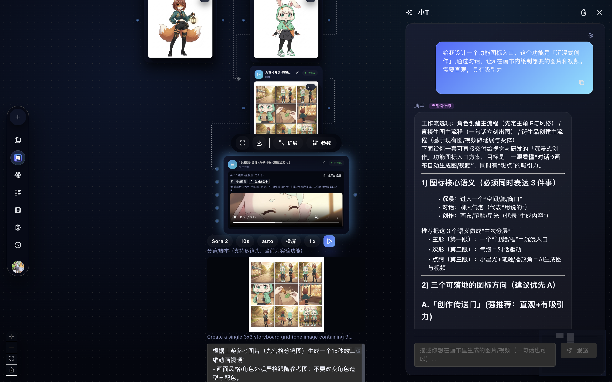

<p align="center">
  
</p>

<h1 align="center">TapCanvas</h1>

TapCanvas is a visual AI creation canvas (text → image → video) built with React Flow + Mantine, designed for fast iteration on multi-step generation workflows.

**Language:** [中文](README.md) | English

## What’s New (2025-12-16): Immersive Creation

TapCanvas now ships an **Immersive Creation** entry (aka **XiaoT**) that lets you **describe what you want directly in the canvas**. It will automatically create/connect nodes and run them to produce images/videos. The legacy “AI assistant” entry is deprecated.

<p align="center">
  
</p>

### How to use (Immersive Creation / XiaoT)

1) Open TapCanvas and click the left floating icon labeled **“沉浸式创作（小T）”**  
2) Pick a built-in workflow (Character / Image / Derivatives) or just type one sentence  
3) Click **Send** → watch the canvas auto-create nodes and generate results  
4) Expand **Execution process** when you want step-by-step traceability and debugging  

Prompt tips:

- “Create a main character visual first (keep a reproducible appearance), then generate a 3×3 storyboard grid, then compose a 10–15s video based on the grid.”
- “Use the existing character/image on my canvas as reference; keep style + identity consistent; produce 3 variants.”

A 3-minute starter example (copy/paste to XiaoT):

```txt
I want a 15-second “Cyber Wuxia” teaser trailer:
1) Create an image node named “Hero Key Visual”: a female swordswoman wearing a bamboo hat; cape edges have neon circuit patterns; weapon is a folding light-blade.
2) Based on the same character, generate a 3×3 storyboard grid (image node). Each panel should specify shot type, action, emotion, and environment (rainy night alley, wet ground, neon reflections).
3) Then generate a 15s video (composeVideo). Use panel 1 as the first frame reference. Keep character identity consistent, pace tight, and camera motion cinematic.
```

## Quick Start

### Local dev (recommended)

```bash
# 1) Install deps
pnpm -w install

# 2) Configure env
cp apps/web/.env.example apps/web/.env
cp apps/hono-api/wrangler.example.jsonc apps/hono-api/wrangler.jsonc

# 3) Init local D1 (optional, recommended)
pnpm --filter cloudflare-workers-openapi db:update:local

# 4) Start (two terminals)
pnpm dev:web
pnpm dev:api
```

### One-command full stack (Docker)

```bash
docker compose up -d

cp apps/web/.env.example apps/web/.env
cp apps/hono-api/wrangler.example.jsonc apps/hono-api/wrangler.jsonc

# Reload env (optional)
docker compose restart
```

### Immersive Creation in Docker (optional)

Immersive Creation (XiaoT) uses LangGraph. Start the extra profile and point your web env to it:

```bash
docker compose --profile langgraph up -d
```

Ensure `apps/web/.env` contains `VITE_LANGGRAPH_API_URL="https://ai.beqlee.icu"` (default for the Docker profile).

## Architecture / Tech Stack

- **Monorepo**: pnpm workspaces (`apps/`, `packages/`)
- **Web**: Vite + React 18 + TypeScript, Mantine UI, React Flow canvas, Zustand state
- **API**: Cloudflare Workers (Wrangler) + Hono, OpenAPI 3.1 + request validation (chanfana)
- **Storage**: D1 (primary), R2 optional for asset hosting
- **Immersive Creation (optional)**: LangGraph Assistant service (Docker `langgraph` profile)

## Environment

- Web (Vite): `apps/web/.env*`
- API (Workers): `apps/hono-api/wrangler*.jsonc/.toml`
- Root `.env.example` is optional (scripts/tools only)

## Verify

- Web: `http://localhost:5173`
- API: `http://localhost:8788`
- API docs: `http://localhost:8788/`

## Docs

- `docs/README.md` (index)
- `docs/docker.md` (Docker)
- `docs/development.md` (local dev)
- `docs/INTELLIGENT_AI_IMPLEMENTATION.md` (AI tool contracts)
- `docs/AI_VIDEO_REALISM_GUIDE.md` (prompt tips)

## TODO / Roadmap

- ✅ **Immersive Creation (LangGraph / XiaoT)**: project-level context + auto create/connect nodes and run them
- **Sora 2 watermark removal**: smarter cleanup for generated videos
- **Video stitching**: seamless multi-clip concatenation + transitions
- **Basic video editing**: trim/split/merge inside TapCanvas

## Contributing

- Issues: https://github.com/anymouschina/TapCanvas/issues
- Discussions: https://github.com/anymouschina/TapCanvas/discussions

## License

Apache-2.0
